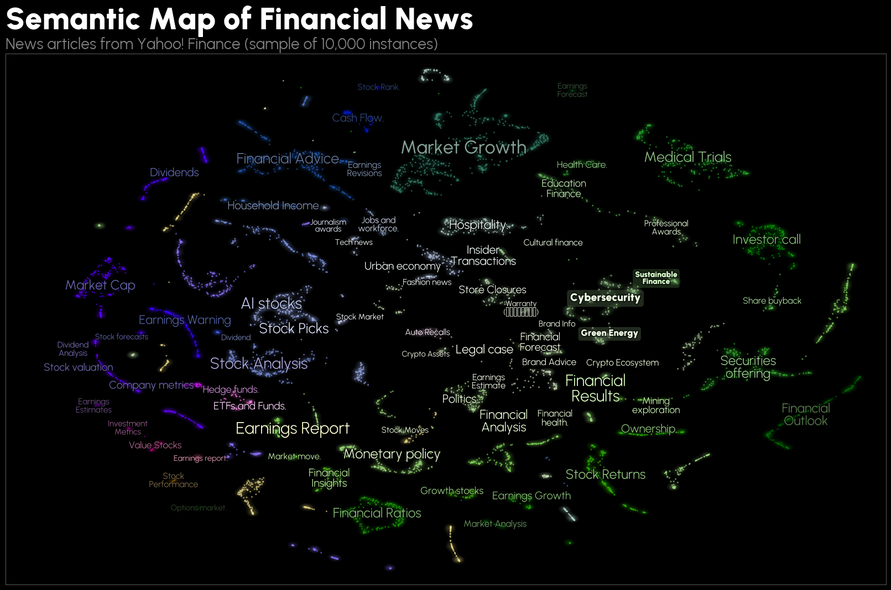

FinABYSS (Financial Aspect-Based Hybrid Semantic System)
---
- [Functionality](#functionality)
  - [Semantic Map](#semantic-map)
    - [Interactivity](#interactivity)
    - [Semantic Similarity](#semantic-similarity)
    - [Search for texts](#search-for-texts)
    - [Timeline infographic](#timeline-infographic)
    - [Sample word cloud](#sample-word-cloud)
  - [Predictor](#predictor)
- [Key dependencies](#key-dependencies)
- [Corpus of financial news articles](#corpus-of-financial-news-articles)
- [Notes](#notes)
  - [Future works](#future-works)
  - [Project Structure](#project-structure)
  - [P.S.](#ps)

# Functionality
## Semantic Map
Семантическая карта может стать неотъемлемой частью рабочего процесса финансового аналитика, инвестора или кого-угодно еще, интересующегося финансами.


### Interactivity
На интерактивной семантической карте нас встречают кластеры, представляющие темы. Каждая **точка является уникальной статьей**, при этом **размер точки указывает на относительную длину статьи**. Более того, каждую статью, мы можем с легкостью найти в Google (в дальнейшем переадресация будет доработана до прямой ссылки).


Итак, мы открываем статью, и во-первых видим насколько она большая — предыдущие модели не смогли бы обработать настолько длинный текст. И во-вторых диоксид углерода действительно упоминается в данной статье.

### Semantic Similarity
Как отмечалось ранее, данная карта достаточно хорошо сохраняет семантическую связь как кластеров, так и самих текстов между собой. Давайте посмотрим детальнее.


Мы видим группу кластеров, связанных со здравоохранением, все они располагаются кучно, но каждый является уникальным. Далее мы можем наблюдать, что *Sustainable Finance*, *Cybersecurity* и *Green Energy* тоже располагаются крайне близко. То же касается и *Politics* с *Monetary Policy*, но данные два кластера, имеют немного большую дистанцию, что вполне оправдано.

### Search for texts
Карта также предоставляет интерфейс к точечному обнаружению необходимых новостей по ключевым словам.


Так, Индонезию чаще всего можно встретить среди растущих рынков и политики, то же относится и к России, но Россия все же превалирует именно в политике.

### Timeline infographic
Что примечательно — мы можем **совмещать поиск по ключевым словам с распределением по датам** публикации или любым другим количественным признаком.


Так, мы можем наблюдать, что перед выборами в США, новостей о Трампе было меньше, чем после его победы. **Эта функция позволяет быстро и крайне просто выявлять исторические события и триггеры**.

### Sample word cloud
Наконец, самое интересное, что мы можем изучить, о чем говорят в новостях того или иного кластера, или просто выбранной группы.


Вполне резонно, что в *Sustainable Finance* чаще говорят об устойчивости, климате и углероде. Напротив, кластер с криптовалютой визуально подразделяется на два. В нижнем больше говорят о конкретных технологиях, а в верхнем скорее общеобразовательный контент на тему криптовалют.

## Predictor
Данная система вовсе не ограничивается лишь семантической картой, которая на самом деле представляет собой интепретируемый интерфейс к более закрытому процессу — прогнозированию стоимости финансовых активов с использованием тематических оценок тональностей.

# Key dependencies
- [Стилевое оформление ВКР](https://github.com/itonik/spbu_diploma/tree/master) с LaTeX-шаблоном для ВКР по ГОСТам;
- [BERTopic](https://github.com/MaartenGr/BERTopic);
- [alpha_vantage](https://github.com/RomelTorres/alpha_vantage);
- [PyTorch](https://github.com/pytorch/pytorch);
- [TensorBoard](https://pytorch.org/tutorials/recipes/recipes/tensorboard_with_pytorch.html) (доки по работе с PyTorch);
- [Polars](https://docs.pola.rs/) для ускорения работы с данными;
- [CUDA 12.1](https://developer.nvidia.com/cuda-toolkit) для ускорения обучения моделей;
- [cuML](https://docs.rapids.ai/api/cuml/stable/) для ускорения обучения моделей;

# Corpus of financial news articles
Датасет со всеми статьями расположен в [репозитории](https://huggingface.co/datasets/denisalpino/YahooFinanceNewsRaw) на HuggingFace.

# Notes
## Future works
| Task                                                                           | Complexity | Priority | Current Status | Finished  |
|------------------------------------------------------|------------|----------|----------------|-----------|
| Additional Corpus Cleaning                                                     | Easy       | High     | in progress    | &#x2611; Formalize rules
| Improve c-TF-IDF implementation                                                | Easy       | High     | in progress    | &#x2610; Configure MinimalMarginalRate from KeyBERT
| Improve Representation of Topics                                               | Normal     | High     | in progress    | &#x2610; Plug in the GPT-4o<br>&#x2610; Figure out how to account for the hierarchical structure
| Develop Hierarchical Structure Processing Logic Inspiring by BERTopic          | Normal     | Medium   | planning       | &#x2610; Explore the BERTopic source code<br>&#x2610; Develop logic for assigning topic names to each level in the hierarchy
| Full-body Training                                                             | Normal     | High     | in progress    | &#x2610; Find and rent infrastructure with GPUs<br>&#x2610; Customize the environment<br>&#x2610; Adapt training code
| ModernBERT Domain Adaptive Pre-Training                                        | Normal     | High     | planning       | &#x2610; (optional) Expand the corpus<br>&#x2610; Find and rent infrastructure with GPUs<br>&#x2610; Write training code
| Evaluate and Compare ModernBERT & FinBERT (DAPT) on GLUE & FLUE benchmarks     | Hard       | High     | planning       | &#x2610; Find and gather all datasets from benchmarks<br>&#x2610; Write code to fine-tune for each of the tasks
| Refine the Semantic Map                                                        | Normal     | Medium   | planning       | &#x2610; Rework hover labels<br>&#x2610; Write custom code to build a word cloud using the native TF-IDF<br>&#x2610; Implement filtering by source<br>&#x2610; Improve the visual design<br>&#x2610; Develop more diverse infographics
| Refine the Text Search in the Semantic Map                                     | Normal     | Low      | planning       | &#x2610; Create the database for texts<br>&#x2610; Remove the texts from hover labels and migrate them into the database<br>&#x2610; Connect search system in the semantic map wit database
| Fine-tuning ModernBERT for Dense Embeddings                                    | Hard       | High     | planning       | &#x2610; ...
| Experimentation with Leiden Сlustering on kNN Graphs                           | Normal     | Low      | backlog        | &#x2610; ...
| Companys' Semantic Graph                                                       | Hard       | Low      | backlog        | &#x2610; ...
| Graph-based News Representation                                                | Hard       | Low      | backlog        | &#x2610; ...

## Project Structure
<details>
<summary>
FinABYSS
</summary>

```bash
├── data
│   ├── preprocessed
│   │   └── articles.parquet
│   └── raw
│       ├── articles.parquet
│       ├── news_urls.parquet
│       └── ohlcv.parquet
├── docs
│   └── ...
├── notebooks
│   ├── aspects
│   │   ├── data
│   │   │   ├── data.csv
│   │   │   └── embeddings.npy
│   │   ├── img
│   │   │   ├── docs_and_topics.png
│   │   │   └── intertopic_distance_map.png
│   │   ├── models
│   │   │   ├── v1
│   │   │   │   ├── aspect.pickle
│   │   │   │   └── hpo.csv
│   │   │   ├── v2
│   │   │   │   ├── hdbscan.pkl
│   │   │   │   └── umap.pkl
│   │   │   ├── v3
│   │   │   │   ├── hdbscan.pkl
│   │   │   │   └── umap.pkl
│   │   │   ├── v4
│   │   │   │   ├── hdbscan.pkl
│   │   │   │   ├── hp_importance.jpg
│   │   │   │   ├── hpo.jpg
│   │   │   │   └── umap.pkl
│   │   │   └── v5
│   │   │       ├── README.md
│   │   │       ├── hdbscan.pkl
│   │   │       └── umap.pkl
│   │   ├── aspects.ipynb
│   │   └── hpo.ipynb
│   ├── data_collecting
│   │   ├── ohlcv.ipynb
│   │   └── yahoo_articles.ipynb
│   └── data_preprocessing
│       ├── img
│       │   ├── dark
│       │   │   └── ...
│       │   └── light
│       │       └── ...
│       ├── articles_preprocessing.ipynb
│       ├── articles_vizualization.ipynb
│       ├── feature_extraction.ipynb
├── paper
│   ├── struct
│   │   └── ...
│   ├── tab
│   │   └── ...
│   ├── img
│   │   └── ...
│   ├── bibliography.bib
│   ├── main.pdf
│   ├── main.tex
│   └── preamble.tex
├── parsers
│   └── yahoo_parser.py
└── utils
    ├── api_key_manager.py
    ├── custom_tqdm.py
    ├── metrics.py
    ├── proxy_manager.py
    └── vizualization.py
├── README.md
├── requirements.txt
├── semmap.html
```
</details>

## P.S.
После того, как проект будет собран, необходимо установить пакет `pipreqsnb` и запустить из окружения команду `pipreqsnb --ignore .venv,venv --force`, которая автоматически просканирует проект, включая ноутбуки, и сформирует файл `requirements.txt`.
Опционально, если управление проектом осуществляется через WSL, тогда имеет смысл создать следующим образом алиас:

```alias pipreqsnb='pipreqsnb --ignore .venv,venv --force'```