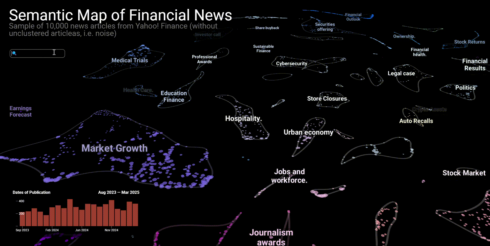
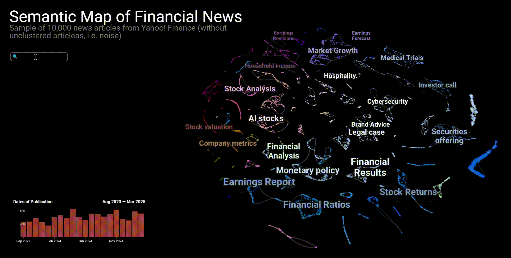

# FinABYSS (Financial Aspect-Based Hybrid Semantic System)

## Functionality
### Semantic Map
Семантическая карта может стать неотъемлемой частью рабочего процесса финансового аналитика, инвестора или кого-угодно еще, интересующегося финансами.


#### Интерактивность
На интерактивной семантической карте нас встречают кластеры, представляющие темы. Каждая **точка является уникальной статьей**, при этом **размер точки указывает на относительную длину статьи**. Более того, каждую статью, мы можем с легкостью найти в Google (в дальнейшем переадресация будет доработана до прямой ссылки).


Итак, мы открываем статью, и во-первых видим насколько она большая — предыдущие модели не смогли бы обработать настолько длинный текст. И во-вторых диоксид углерода действительно упоминается в данной статье.

#### Семантическая близость
Как отмечалось ранее, данная карта достаточно хорошо сохраняет семантическую связь как кластеров, так и самих текстов между собой. Давайте посмотрим детальнее.


Мы видим группу кластеров, связанных со здравоохранением, все они располагаются кучно, но каждый является уникальным. Далее мы можем наблюдать, что *Sustainable Finance*, *Cybersecurity* и *Green Energy* тоже располагаются крайне близко. То же касается и *Politics* с *Monetary Policy*, но данные два кластера, имеют немного большую дистанцию, что вполне оправдано.

#### Поиск новостей
Карта также предоставляет интерфейс к точечному обнаружению необходимых новостей по ключевым словам.



Так, Индонезию чаще всего можно встретить среди растущих рынков и политики, то же относится и к России, но Россия все же превалирует именно в политике.

#### Временная инфографика
Что примечательно — мы можем **совмещать поиск по ключевым словам с распределением по датам** публикации или любым другим количественным признаком.



Так, мы можем наблюдать, что перед выборами в США, новостей о Трампе было меньше, чем после его победы. **Эта функция позволяет быстро и крайне просто выявлять исторические события и триггеры**.

#### Облако слов по выборке
Наконец, самое интересное, что мы можем изучить, о чем говорят в новостях того или иного кластера, или просто выбранной группы.


Вполне резонно, что в *Sustainable Finance* чаще говорят об устойчивости, климате и углероде. Напротив, кластер с криптовалютой визуально подразделяется на два. В нижнем больше говорят о конкретных технологиях, а в верхнем скорее общеобразовательный контент на тему криптовалют.

### Архитектура
Данная система вовсе не ограничивается лишь семантической картой, которая на самом деле представляет собой интепретируемый интерфейс к более закрытому процессу — прогнозированию стоимости финансовых активов с использованием тематических оценок тональностей.

## Notes
### Ключевые зависимости:
- [Стилевое оформление ВКР](https://github.com/itonik/spbu_diploma/tree/master) с LaTeX-шаблоном для ВКР по ГОСТам;
- [BERTopic](https://github.com/MaartenGr/BERTopic);
- [alpha_vantage](https://github.com/RomelTorres/alpha_vantage);
- [PyTorch](https://github.com/pytorch/pytorch);
- [TensorBoard](https://pytorch.org/tutorials/recipes/recipes/tensorboard_with_pytorch.html) (доки по работе с PyTorch);
- [Polars](https://docs.pola.rs/) для ускорения работы с данными;
- [CUDA 12.1](https://developer.nvidia.com/cuda-toolkit) для ускорения обучения моделей;
- [cuML](https://docs.rapids.ai/api/cuml/stable/) для ускорения обучения моделей;

### Корпус финансовых новостных статей:
Датасет со всеми статьями расположен в [репозитории](https://huggingface.co/datasets/denisalpino/YahooFinanceNewsRaw) на HuggingFace.
### P.S.
После того, как проект будет собран, необходимо установить пакет `pipreqsnb` и запустить из окружения команду `pipreqsnb --ignore .venv,venv --force`, которая автоматически просканирует проект, включая ноутбуки, и сформирует файл `requirements.txt`.
Опционально, если управление проектом осуществляется через WSL, тогда имеет смысл создать следующим образом алиас:

```alias pipreqsnb='pipreqsnb --ignore .venv,venv --force'```